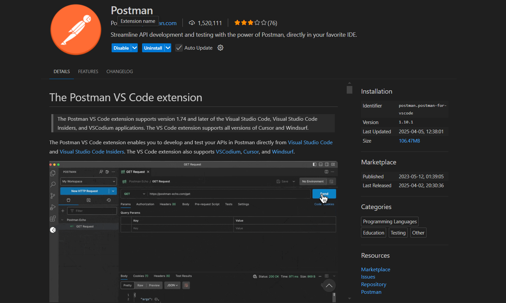
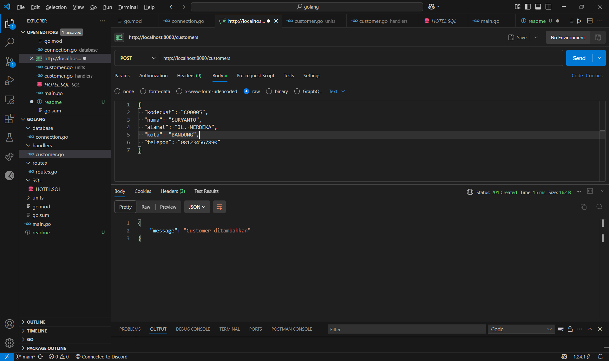

## Hotel Management API
ini adalah hotel management API 
Update v1.0 API management Costumer
### Test API
API ini ditest menggunakan Postman Extensions pada VS code


##  Cara menjalankan
edit database connection
lalu kemudian jalankan SQL yang anda punya
### Database Connection
File 
database/connection.go
ganti akun dan password sesuai dengan database sql yang digunakan. 
Konfigurasi yang digunakan pada API saat ini
* connection
```sh
dsn := "root:@Derysurya12345@tcp(127.0.0.1:3306)/db_uco"
```
Contoh konfigurasi koneksi database:
* connection
```sh
dsn := "root:password@tcp(127.0.0.1:3306)/db_uco"
```
### Run Code
Lalu jalankan main.go 
```
go run main.go
```
## Struktur tabel customer
```s 
  customer (
  kodecust VARCHAR(6) PRIMARY KEY,
  nama     VARCHAR(20) NOT NULL,
  alamat   VARCHAR(30) NOT NULL,
  kota     VARCHAR(15) NOT NULL,
  telepon  VARCHAR(15) NOT NULL
);
```
## API Endpoint

Base url Endpoint Costumer
* url
```sh
  http://localhost:8080/customers
```
### Routes
```sh
	customer := r.Group("/customers")
	{
		customer.GET("/", handlers.GetCustomers)
		customer.GET("/:id", handlers.GetCustomerByID)
		customer.POST("/", handlers.CreateCustomer)
		customer.PUT("/:id", handlers.UpdateCustomer)
		customer.DELETE("/:id", handlers.DeleteCustomer)
	}

```

### GET customer
GET /customers/
untuk mengambil semua data yang ada pada tabel customer
* Link
```sh
  http://localhost:8080/customers
```
* Response
```sh
[
    {
        "kodecust": "C00001",
        "nama": "YOHANES KAREL",
        "alamat": "RAMPAL KULON 12",
        "kota": "MALANG",
        "telepon": "6503478"
    },
    {
        "kodecust": "C00002",
        "nama": "YUSAK WINATA",
        "alamat": "MASPATI III/25",
        "kota": "SURABAYA",
        "telepon": "8658898"
    },
    {
        "kodecust": "C00003",
        "nama": "LISTYA ARINI",
        "alamat": "MAWAR 14",
        "kota": "JAKARTA",
        "telepon": "5934485"
    },
    {
        "kodecust": "C00004",
        "nama": "YOLANDA HIDAYATI",
        "alamat": "TALANG 1",
        "kota": "MALANG",
        "telepon": "7894455"
    }
]
```
### GET /customers/{kodecust}
mengambil data customer berdasarkan kodecust
Contoh 
* url
```sh
http://localhost:8080/customers/C00004
```
* response
```sh
    {
    "kodecust": "C00004",
    "nama": "YOLANDA HIDAYATI",
    "alamat": "TALANG 1",
    "kota": "MALANG",
    "telepon": "7894455"
    }
```

###  POST /customers/
untuk menambahkan data baru kedalam tabel customer

* url
```sh
http://localhost:8080/customers/
```
isi raw pada postman dengan format sesuai di gambar

* contoh costumer
```sh
{
  "kodecust": "C00005",
  "nama": "SURYANTO",
  "alamat": "JL. MERDEKA",
  "kota": "BANDUNG",
  "telepon": "081234567890"
}
```

### GET Semua Customer
### GET Semua Customer